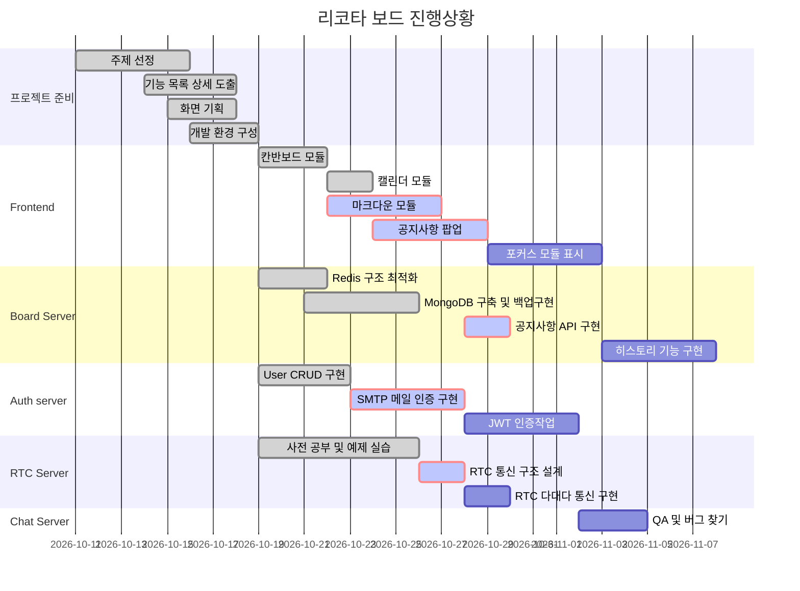

# Ricotta Board Project

- **프로젝트 소개** 

    리코타 보드는 Real-time Cooperation Task Board 를 줄여서 만든 네이밍 입니다.

    리코타보드는 실시간 동기화 보드라는 아이디어에서 착안하여 함께 회의를 하며 협업을 진행할 수 있는 올인원 협업툴을 목표로 진행되었습니다.
    
    리코타보드 서비스 페이지 는 업데이트 

- **진행기간**

    2020.10.12 - 2020.11.27 (총 7주)

- **팀 소개(Team Hungry Bird)**

    Front : 정진권
 
    Back : 이정훈, 최문경
 
    Full Stack : 김강현, 정용우
    
- **기술스택**

    `Backend` - Java + Spring Boot + Gradle, JPA, Node.js + Express
    
    `Frontend` - JS + Vue.js, HTML, CSS
    
    `DB` - Redis, MariaDB, MongoDB
    
    `CI/CD` - Jenkins
    
    `웹 서버` - NGINX
    
    `배포 서버` - AWS EC2
    
    `협업 도구` - GitLab, Jira, Notion
    
    `아키텍처` - MSA, Spring MVC

## Preview

제작한 협업보드를 통해 회의를 진행하는 모습입니다.

## Ricotta Board Main Page

## Introduce Ricotta Board 

